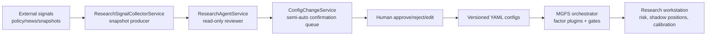
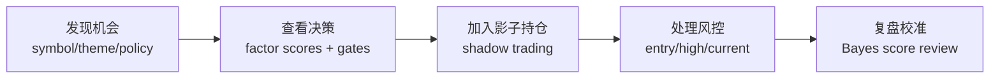
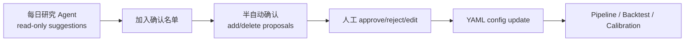
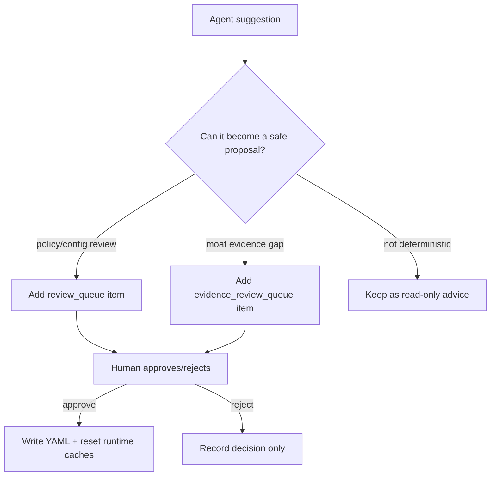

# Sentinel / MGFS Research Workstation

Sentinel started as a market sentiment anomaly collector. The current project also
contains the MGFS (Moat, Growth/Policy, Fair value, Timing) research workstation:
a local FastAPI + HTMX dashboard for value research, config governance, evidence
review, shadow-position monitoring, and calibration.

The important boundary is deliberate:

> External signals and agents can propose review items, but they do not directly
> rewrite YAML. YAML changes go through a human confirmation step.

## Project Map



## Main Surfaces

### Research Dashboard

Route: `http://localhost:8000/dashboard/research`

The research dashboard is the day-to-day MGFS workstation:



It renders:

- `MGFS 分层链路`: visible explanation of the research flow.
- `总分构成配置`: scoring weights and rating thresholds.
- `机会雷达`: single-symbol evaluation and theme scanning.
- `决策票据`: factor scores, evidence gaps, action, and risk notes.
- `影子持仓`: research-only position tracking.
- `组合风控`: stop-loss and alert monitoring.
- `贝叶斯校准`: post-review score calibration.

### Ops Dashboard

Route: `http://localhost:8000/dashboard/ops`

The ops dashboard separates agent suggestions, human confirmation, YAML editing,
pipeline execution, and historical validation:



Key panels:

- `每日研究 Agent`: generates read-only suggestions from local config and external
  signal snapshots.
- `半自动确认`: shows structured add/delete proposals. Approving a proposal is the
  point where YAML can be changed.
- `配置控制台`: manual YAML editor with validation and hot reload.
- `流水线监控`: batch execution history and status.
- `历史回测`: point-in-time validation and calibration reports.

## Human Confirmation Flow

Agent suggestions are not the same as config changes.



Examples:

- `政策白名单有新外部信号待复核` becomes a `review_queue` candidate in
  `policy_whitelist.yaml`.
- `护城河评分缺少证据字段` becomes an `evidence_review_queue` candidate in
  `moat_static_base.yaml`.
- The system does **not** fabricate `source`, `as_of`, `confidence`, or
  `bear_case`; those fields still require real research evidence.

## Setup

From the repository root:

```bash
python -m venv .venv
source .venv/bin/activate
pip install -r requirements.txt
```

If imports fail in local commands, run them with `PYTHONPATH=.` from the checkout
root.

## Run The Web Workstation

```bash
PYTHONPATH=. python -m uvicorn sentinel.web.main:app --host 127.0.0.1 --port 8000
```

Then open:

- `http://localhost:8000/dashboard/research`
- `http://localhost:8000/dashboard/ops`

The root route `/` redirects to `/dashboard/research`.

## CLI Entrypoints

Legacy sentiment collection:

```bash
python main.py run --market A股
```

Single-symbol MGFS evaluation:

```bash
python main.py evaluate 600519 --market A股 --asset-class equity --sector 白酒
```

Theme scan:

```bash
python main.py scan AI_Compute_Infrastructure --policy neutral
```

Supported market labels are `A股`, `港股`, `美股`, and `币圈`.

## Core Config Files

- `config/mgfs_config.yaml`: factor weights, rating thresholds, circuit breakers,
  and evidence gates.
- `config/moat_static_base.yaml`: static moat score assumptions and evidence
  review queue.
- `config/policy_whitelist.yaml`: sector policy ratings, multipliers, and policy
  review queue.
- `config/valuation_sector_routing.yaml`: sector-to-valuation archetype routing.
- `config/ecosystem_themes.yaml`: macro themes, hot themes, and ecosystem roles.
- `config/research_signal_sources.yaml`: external signal source configuration.

Runtime outputs live under `data/`, including research-agent runs and external
signal snapshots.

## Tests

Use:

```bash
PYTHONPATH=. pytest tests -q
```

Focused web checks:

```bash
PYTHONPATH=. pytest \
  tests/test_web_config.py \
  tests/test_web_research_agent.py \
  tests/test_web_workstation_ui.py \
  tests/test_config_change_service.py \
  -q
```

## Design Notes

- The workstation is intentionally multi-panel: each stage has its own visible
  component instead of hiding the research loop behind one large form.
- External signal collection, agent review, and config mutation are separate
  responsibilities.
- Direct trading instructions are out of scope. Outputs are research-only and
  should be treated as evidence, hypotheses, or review tasks.
- Live market data providers may fail or rate-limit; tests should prefer local
  deterministic fixtures where possible.
